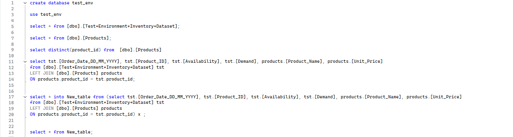
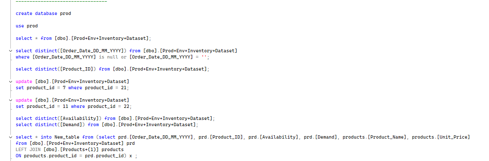
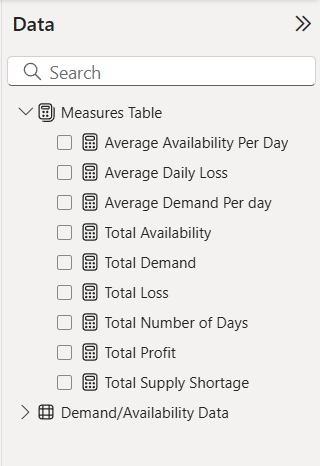
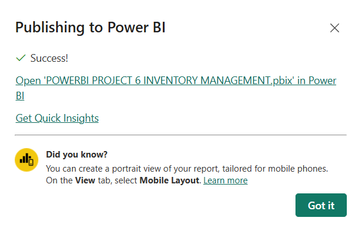
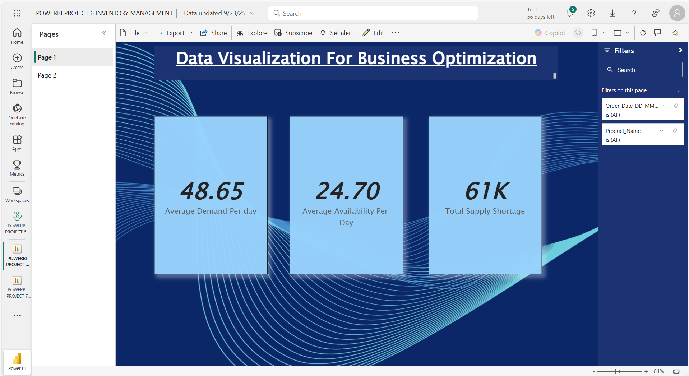

# Inventory Management Dashboard (Datasource: MYSQL Database)

### Dashboard Link : https://app.powerbi.com/reportEmbed?reportId=457bba18-4113-4fdd-8e1d-5912742a9019&autoAuth=true&ctid=4190cc35-fd93-4aa6-9817-c1121132f7e2

## Problem Statement

This dashboard provides a detailed analysis of inventory and supply-demand performance, helping businesses optimize operations by understanding product availability, demand fluctuations, and financial outcomes. It enables monitoring of critical KPIs such as average daily demand, availability, supply shortages, profit, and loss.

Through the visualizations, users can identify the daily demand (48.65 units) against daily availability (24.70 units), highlighting a total supply shortage of 61K units. These insights allow businesses to quickly identify gaps between product demand and inventory levels.

The financial overview shows that while total profit stands at 301K, total losses have accumulated to 8M, with an average daily loss of 2.97K. This emphasizes the urgent need for better demand forecasting, inventory planning, and loss control strategies to improve business outcomes.

The dashboard also incorporates product-level and date-based filters, enabling dynamic exploration of individual product performance and time-based demand patterns. With KPI-driven insights, stakeholders can pinpoint underperforming areas, optimize resource allocation, and plan corrective actions effectively.

Overall, this analysis empowers decision-makers to improve operational efficiency, minimize losses, and drive profitability through data-driven inventory management strategies.

### Steps followed 

- Step 1 : The data was first prepared in SQL Server as part of the test environment. Order and product details were imported from CSV files, and the integrity of the data was verified using SQL queries to check distinct counts, null values, and completeness. A joined table combining product information with inventory data was created using SQL.

- Step 2 : Power BI Desktop was connected to the SQL Server database in Import mode. In Power Query Editor, column data types were validated and standardized to ensure numeric, date, and text fields aligned with the intended schema. Initial transformations were applied to prepare the dataset for analysis.
- Step 3 : KPIs were defined to represent the most critical business metrics for inventory optimization. On Page 1 of the report, three card visuals were created to display Average Demand per Day, Average Availability per Day, and Total Supply Shortage. These visuals provided stakeholders with a snapshot of whether inventory levels were meeting customer demand.
- Step 4 : On Page 2 of the report, financial KPIs were emphasized. Card visuals were used to represent Total Profit, Total Loss, and Average Daily Loss. This allowed the business to quantify financial outcomes of inventory management practices and identify areas of concern, such as high daily losses.
- Step5 : To calculate these KPIs, a dedicated measures table was created in Power BI to centralize all DAX measures. Measures such as Total Demand, Total Availability, Total Profit, Total Loss, and Average Daily Loss were defined using SUMX and DIVIDE functions. Adjustments were made so that loss values displayed as positive figures, improving readability and avoiding confusion with double negatives.

**Average Demand Per day**:
```DAX
  Average Demand Per day = DIVIDE([Total Demand],[Total Number of Days])
  ```

**Average Availability Per Day**:
  ```DAX
Average Availability Per Day = DIVIDE([Total Availability], [Total Number of Days])
```
**Total Supply Shortage**:
  ```DAX
Total Supply Shortage = [Total Demand] - [Total Availability]
```
**Total Profit**:
  ```DAX
Total Profit = SUMX(FILTER('Demand/Availability Data', 'Demand/Availability Data'[Loss/Profit] > 0), 
'Demand/Availability Data'[Loss/Profit] * 'Demand/Availability Data'[Unit_Price])
```
**Total Number of Days**:
  ```DAX
Total Number of Days = DISTINCTCOUNT('Demand/Availability Data'[Order_Date_DD_MM_YYYY].[Date])
```
**Total Loss**:
  ```DAX
Total Loss = SUMX(FILTER('Demand/Availability Data', 'Demand/Availability Data'[Loss/Profit] < 0),
'Demand/Availability Data'[Loss/Profit]* 'Demand/Availability Data'[Unit_Price]) * -1
```
**Total Demand**:
  ```DAX
Total Demand = SUM('Demand/Availability Data'[Demand])
```
**Total Availability**:
  ```DAX
Total Availability = SUM('Demand/Availability Data'[Availability])
```
**Average Daily Loss**:
  ```DAX
Average Daily Loss = DIVIDE([Total Loss], [Total Number of Days])
```

- Step 6 : After validation in the test environment, the data model and KPIs were migrated to the production environment. The production dataset contained more records, and initial mismatches in product IDs (22 instead of 20) were corrected using SQL UPDATE queries. Schema consistency between test and production ensured that all DAX measures and visuals refreshed seamlessly once the data source was updated.

- Step 7 : A transition was then performed from SQL Server to MySQL. The MySQL schema was recreated to mirror the SQL Server structure, ensuring identical column names and aliases. Power BI was reconnected to the MySQL backend using the MySQL Connector, and all visuals continued to function correctly without requiring rework of measures or reports.

- Step 8 : Report styling was applied using a professional dark theme to maintain visual clarity. Filters for Order Date and Product Name were added to both report pages, enabling users to perform interactive, product-level and time-based analysis.
- Step 9 : A dedicated Measures Table was created in Power BI to centralize all DAX measures. This ensured that all calculations, such as year-on-year sales growth, offer-to-SQM ratio, and total YTD sales, were well organized, reusable, and easy to maintain during report development.

- Step 10 : The report was published to the Power BI Service, with two separate workspaces created for governance: one for SQL Server-based reports and another for MySQL-based reports.

- Step 11 : he finalized dashboard provided a comprehensive view of business optimization, balancing supply-demand insights with profitability analysis. By validating interactions across slicers, the report confirmed smooth interactivity and reliable use for decision-making.


# Snapshot of Dashboard (Power BI Service)

 



 

## Inventory Management Dashboard – Insights  

A two-page report was created in Power BI Desktop and then published to Power BI Service. The dashboard focused on monitoring business optimization through inventory management and provided visibility into demand, availability, shortages, and financial outcomes.  

### 1. Demand and Supply Analysis  
The report revealed that the **average daily demand** was **48.65 units**, while the **average daily availability** stood at only **24.70 units**. This mismatch resulted in a **total supply shortage of 61K units**. These insights highlight a significant gap between supply and demand, suggesting that production or procurement processes need to be scaled up to meet customer requirements.  

### 2. Profit and Loss Metrics  
The financial KPIs showed a **total profit of 301K** compared to a much larger **total loss of 8M**, with an **average daily loss of 2.97K**. This indicates that inefficiencies in inventory management and unmet demand are translating into major financial setbacks, outweighing the profits by a large margin. The visibility of this imbalance helps decision-makers prioritize corrective actions such as reducing stockouts and improving forecasting accuracy.  

### 3. Business Optimization Opportunities  
The dashboard emphasized the importance of tracking **losses per day**, which provides a quick diagnostic metric for business health. By comparing demand and supply patterns against profitability, the report identified that inventory shortages are the primary driver of financial losses. Addressing these shortages through improved procurement strategies or enhanced supply chain planning can significantly optimize business performance.  

### 4. Transition from Test to Production  
An important technical learning during the project was the **transition of the data model from test to production environments**. The test environment was initially built using SQL Server with smaller datasets, while production had larger volumes and additional product IDs. Handling schema mismatches, validating measures across environments, and ensuring that visuals refreshed correctly in production strengthened understanding of real-world data workflows. Additionally, migrating the backend from SQL Server to MySQL while maintaining schema consistency ensured the dashboards continued to function seamlessly without requiring redesign.  

### 5. Key Learning  
This project not only highlighted how inventory imbalances affect profitability but also provided valuable hands-on experience in managing **end-to-end deployment**, from **test modeling** to **production readiness**, ensuring that KPIs remain accurate and scalable in different environments.  
